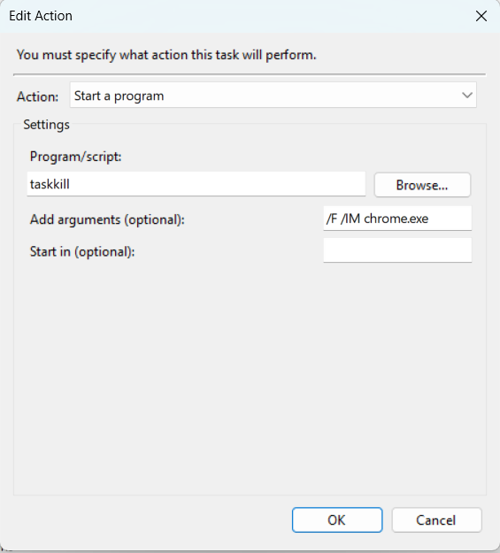
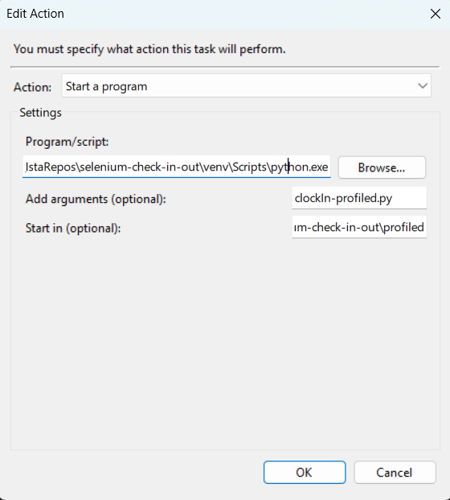
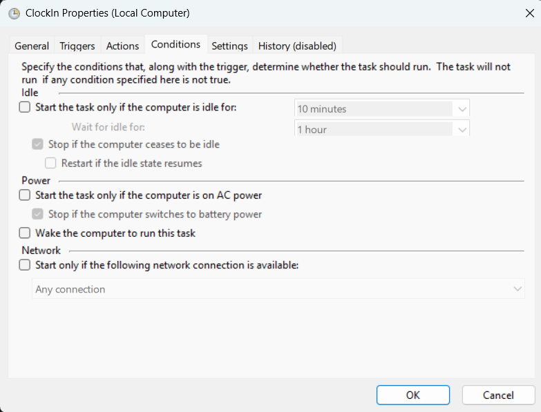

# Selenium Check In/Out

Este proyecto automatiza el check-in y check-out usando **Selenium**.

## 1. Crear un perfil de Chrome fuera de la carpeta por defecto

En CMD, ejecuta:

"C:\Program Files\Google\Chrome\Application\chrome.exe" --user-data-dir="C:\Users\NombreUsuario\PerfilSelenium"

Luego, inicia sesión en Google con el perfil recién creado.

## 2. Configurar el proyecto

Abrir PowerShell en la carpeta del proyecto y ejecutar:

# Crear archivo .env
# Crear entorno virtual
python -m venv venv

# Instalar dependencias
pip install -r requirements.txt

## 3. Ejecutar un archivo

### 3.1 Opción 1 (Manualmente por consola)

#### 3.1.1 Perfil profiled

cd profiled
taskkill /F /IM chrome.exe
C:/Users/Usuario/CiklumRepos/selenium-check-in-out/venv/Scripts/Activate.ps1
-   python clockIn-profiled.py
-   python clockOut-profiled.py

#### 3.1.2 Perfil not-profiled

cd not-profiled
taskkill /F /IM chrome.exe
C:/Users/Usuario/CiklumRepos/selenium-check-in-out/venv/Scripts/Activate.ps1
-   python clockIn.py 
-   python clockOut.py

## 3.2 Opción 2 (Ejecutar archivo automáticamente con Task Scheduler)

1. Abrir Task Scheduler y crear una tarea (Create Task)  
2. Rellenar los campos:
   - Nombre: clockIn / clockOut  
   - Trigger: Semanal - Lunes a viernes a la hora deseada  
   - Actions:
     
     
     
   
   - Conditions:
     
       
   - Settings: Activar "Run task as soon as possible after a scheduled start is missed"

## 4. Notas

- Asegúrate de reemplazar NombreUsuario con tu usuario real de Windows.  
- Asegúrate de reemplazar "C:/Users/Usuario/CiklumRepos/selenium-check-in-out" con tu carpeta del repositorio.  
- Las imágenes (images/Action1.png, etc.) deben existir en la carpeta images/ del repositorio.  
- Antes de ejecutar cualquier script, cierra Chrome (taskkill /F /IM chrome.exe) para evitar conflictos de sesión.
